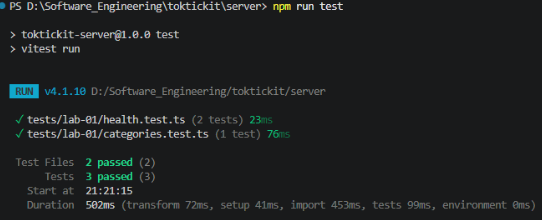
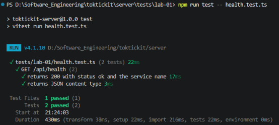
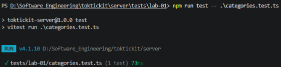
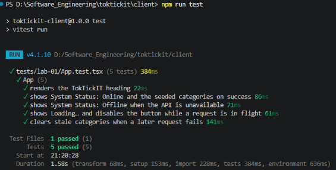
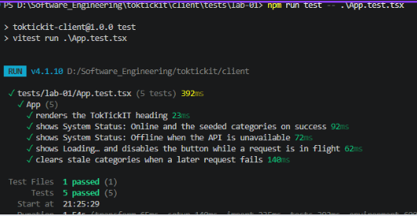
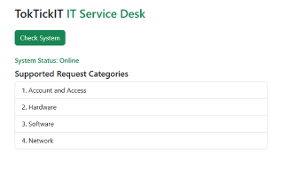
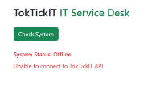

# Lab 1 — Test Plan and Evidence  (fill this in)

All test files live under server/tests/lab-01/ and client/tests/lab-01/.

| # | Tool | Test | Result |
|---|------|------|--------|
| 1 | Supertest | GET /api/health returns 200, status=ok |passed|
| 2 | Supertest | GET /api/categories returns 4 seeded categories in id order | passed|
| 3 | Vitest | Heading renders |passed |
| 4 | Vitest | Success state shows Online + category list | passed|
| 5 | Vitest | Error state shows Offline + message |passed |

Paste your passing terminal output / screenshot below.
ฝั่ง server 
supertest

GET /api/health

GET /api/categories

ฝั่ง client
supertest

Heading renders

Success state shows Online + category list

Error state shows Offline + message
